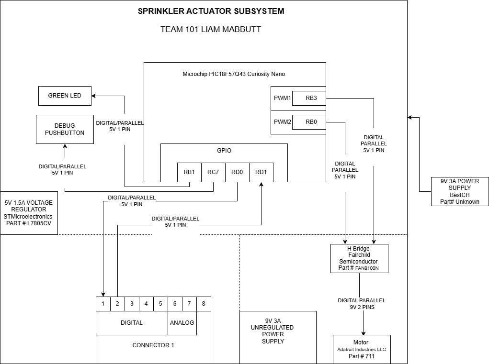

## Overview

This block diagram shows the layout of **Sprinkler Actuator Subsystem**, centered on the **PIC18F57Q43 Curiosity Nano** microcontroller. The system uses a **5 V, 1.5 A voltage regulator** to power logic components and a **9 V, 3 A supply** for the **711 DC motor**, controlled through the **FAN8100N H-bridge**. A **debug pushbutton**, **green LED**, and **Connector 1** provide user input, system feedback, and expansion connections. The design efficiently manages power and control signals, ensuring reliable operation for automated irrigation control.

## Individual Block Diagram 

