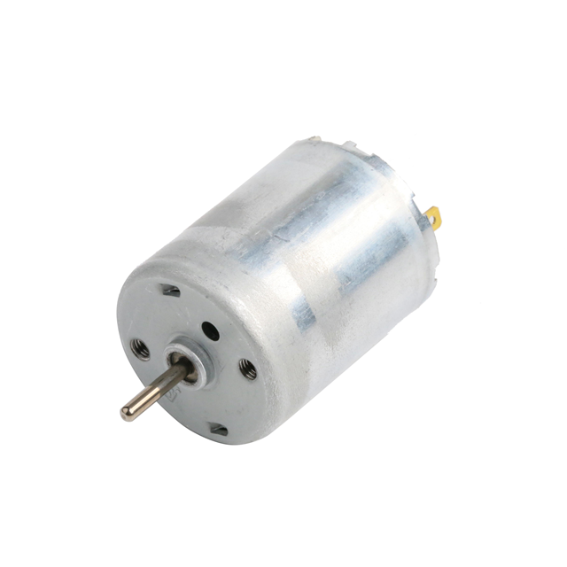
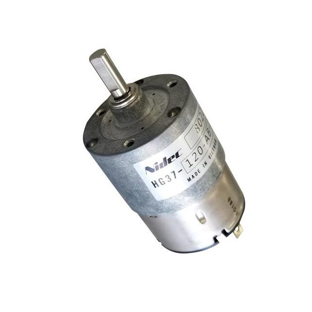
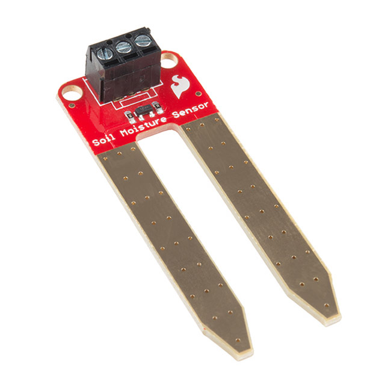
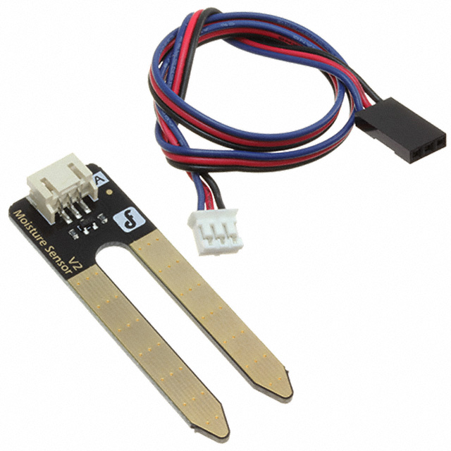
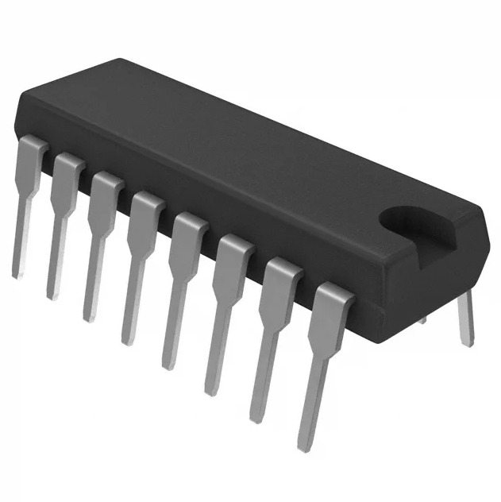

### Componenet Selection

**DC Motor**

1. PC280LG-301

    

    * $1.95/each
    * [link to product](https://www.digikey.com/en/products/detail/adafruit-industries-llc/711/5353610?gclsrc=aw.ds&gad_source=1&gad_campaignid=20243136172&gbraid=0AAAAADrbLlhl1FW1Wjj4ieek0F8WLsTTK&gclid=CjwKCAjwjffHBhBuEiwAKMb8pIf5j8fn3Y5DqKT9JQaZDD6ReWLr_gdSpv1T_ynpheKjqwGf2sxxZBoCSCIQAvD_BwE)

    | Pros                                                              | Cons                |
    | ----------------------------------------------------------------- | ------------------- |
    | Very high no-load speed (~9,100 RPM) — good for fast small mechanisms and toy/hobby use. | Low rated torque (≈10 g·cm / 0.098 N·cm) — not suitable for heavy loads or direct-drive high-torque tasks. |
    | Low no-load current (~70 mA) and modest loaded current (~250 mA) — easy to drive from small motor drivers or battery packs. | Stall current fairly low (~500 mA) but still requires driver/device that can handle stalls; continuous high load will overheat. |
    | Rated 6 V (operating range commonly ~4.5–9 V for hobby use) — flexible for 5 V/6 V/9 V systems. | Not specified for precision speed control or long-term continuous duty at higher voltages; expect shorter life if run hot/overloaded. |
    | 130-size hobby motor — small (≈27.5 × 20 × 15 mm), light (~17.5 g) and easy to integrate into hobby builds; common shaft diameter (2 mm). | Shaft is small (2 mm) and short (8 mm) — may need couplers/gears for secure mounting; no integrated mounting flanges — adds mechanical adaptation work. |
    | Excellent for lightweight robotics, small fans, toys, and prototyping where speed > torque. | Poor choice for gearless drivetrains, heavy actuators, or continuous high-torque applications without gearing. |

2. HG37-120-AA-00

    

    * $29.92/each
    * [Link to product](https://www.digikey.com/en/products/detail/nidec-components-corporation/HG37-120-AA-00/14553405?gclsrc=aw.ds&gad_source=1&gad_campaignid=20243136172&gbraid=0AAAAADrbLljBQunprEOtznelsRLs-J4uH&gclid=CjwKCAjwmNLHBhA4EiwA3ts3mSe77BaK-WFdIAoTd1RI54J1lqSxFic8uShvaWAAsPBEAm5zt6otORoC6HsQAvD_BwE)

    | Pros                                                              | Cons                |
    | ----------------------------------------------------------------- | ------------------- |
    | Integrated planetary gearbox (1:120) — delivers usable low speed and much higher output torque than raw motor. Good for compact, low-RPM actuators.                                            | Relatively high unit cost.      |
    | Moderate continuous torque (~392 mN·m) — suitable for small mechanical loads without extra gearbox.                               | Brushed DC motor (likely) — brush wear and EMI; not as long-lived as brushless options for heavy continuous-duty applications. |
    | Compact (Ø37 mm) — small footprint that fits into constrained mechanical designs. | No integrated encoder/feedback — add external encoder or sensor for closed-loop position/speed control. |

3. **Custom Electrical Option/Mechanical Option**
       A compact planetary gearbox + output rotary encoder + driver + mounting built around a small DC can motor. This option is intended where off-the-shelf torque/speed/feedback packages are unavailable or you want tighter control over form-factor, gear ratio, and sensor placement.

   | Pros                                      | Cons                                                             |
   | ----------------------------------------- | ---------------------------------------------------------------- |
   |Custom ratio & footprint — choose exact gear ratio, shaft length, and mounting pattern to fit your device.| Higher design & build complexity vs buying an off-the-shelf geared motor.|
   |Easier maintenance/repair — you can replace gears, bearings, encoder separately.|Prototype accuracy depends on manufacturing quality (3D printed gears/print tolerances introduce backlash).|
   |Integrated high-resolution feedback — encoder on output gives direct, backlash-compensated position readings.|Longer development time & potential higher unit cost for single pieces.|

**Choice and Rationale**
    The Adafruit 711 DC motor is an appropriate choice for our autonomous irrigation project due to its low power consumption, compact size, and simple control requirements. Operating efficiently at a range up to 9V with a low current draw, it can be easily powered by our chosen H-Bridge. Its high rotational speed and lightweight design make it suitable for driving small pumps, valves, or mechanical actuators that manage water flow in an irrigation setup. While it is not intended for heavy-duty pumping, it offers a cost-effective and reliable option for demonstration-scale or prototype irrigation systems, where energy efficiency and ease of integration with microcontrollers are priorities.
   
**Soil Moisture Sensor**

1. 13637

    

    * $7.95/each
    * [link to product](https://www.digikey.com/en/products/detail/sparkfun-electronics/13637/7400839?gclsrc=aw.ds&gad_source=1&gad_campaignid=20243136172&gbraid=0AAAAADrbLljBQunprEOtznelsRLs-J4uH&gclid=CjwKCAjwmNLHBhA4EiwA3ts3mayriRdZcvui0HTdYMicDMSrmrPi3kqTxbDrLqTR_hUmT-cr0AV9jhoCaVgQAvD_BwE)

    | Pros                                      | Cons                                                             |
    | ----------------------------------------- | ---------------------------------------------------------------- |
    | Capacitive measurement — less corrosion-prone and longer-lasting than resistive probes.| Analog output only — requires ADC input on the microcontroller. |
    | Simple 3-wire interface — easy to connect to Arduino, ESP32, or other MCUs.| Not factory-calibrated — needs user calibration for absolute moisture values.|
    | Wide voltage range (3.3–5 V) — compatible with both 3.3 V and 5 V systems. | Sensitive to electrical noise — may need filtering or shielding in long-wire installations. |

2. SEN0114

        

    * $2.70/each
    * [Link to product](https://www.digikey.com/en/products/detail/dfrobot/SEN0114/6588525?gclsrc=aw.ds&gad_source=1&gad_campaignid=20243136172&gbraid=0AAAAADrbLljBQunprEOtznelsRLs-J4uH&gclid=CjwKCAjwmNLHBhA4EiwA3ts3mbQSvFXrFn6uSSuxGg_qehQQK9Uty_P8yXZ4lFzpzHMJX-7nO5745RoCtCwQAvD_BwE)

    | Pros                                                              | Cons                |
    | ----------------------------------------------------------------- | ------------------- |
    | Low-cost sensor — one of the most inexpensive soil moisture probes available.                                         | Prone to corrosion — exposed electrodes degrade quickly when left in wet soil for long periods.     |
    | Simple 3-wire analog interface — easily integrates with microcontrollers (Arduino, ESP32, etc.).                                | Requires calibration — analog output varies with soil type and salinity; no absolute moisture reference. |
    | Compatible with both 3.3 V and 5 V logic — flexible for most embedded platforms. | High current draw (~35 mA) compared to capacitive alternatives (less suitable for low-power systems). |

3. **Custom Electrical Option/Mechanical Option**
    Design a durable, low-power, accurate soil-moisture sensing module. Uses a capacitive sensing element, temperature compensation, waterproofing, and an optional digital output (I²C) for easy integration.

| Pros                                                                                   | Cons                                                                          |
| -------------------------------------------------------------------------------------- | ------------------------------------------------------------------------------------ |
| **Low corrosion** (capacitive) — longer lifetime than exposed resistive probes.        | **Higher complexity & cost** than cheap resistive probe.                             |
| **Low power** — can be battery operated for months/years.                              | **Probe coating affects sensitivity** — must choose coating carefully and calibrate. |
| **High accuracy & repeatability** with cap-to-digital IC and temperature compensation. | **Environmental factors (salinity, soil composition)** still require calibration.    |
| **Digital output & easy integration** (I²C/ADC) for embedded projects.                 | **Sealing & waterproofing complexity** — requires good mechanical design.            |
| **Customizable form factor & depth sensitivity** via probe geometry.                   | **Long-term drift possible** — periodic recalibration recommended.                   |

**Choice and Rationale**
    The **SEN0114 soil moisture sensor** was selected as the best option because it offers a reliable and easy-to-use design with analog output, making it simple to integrate into a microcontroller-based system. It provides stable readings compared to cheaper resistive sensors and is less prone to corrosion due to its corrosion-resistant coating. The SEN0114 also includes clear documentation and calibration support from DFRobot, ensuring consistent data collection for soil monitoring applications. While it is slightly more expensive than basic resistive sensors like the 13637, its improved durability, accuracy, and compatibility with embedded systems make it the most dependable and efficient choice for this project.

   **H Bridge**

1. INA125P

    

    * $10.08/each
    * [link to product](https://www.digikey.com/en/products/detail/texas-instruments/INA125P/254670?gclsrc=aw.ds&gad_source=4&gad_campaignid=20228387720&gbraid=0AAAAADrbLlhdskTRyyOweqI0wZs3p_N9a&gclid=CjwKCAjwmNLHBhA4EiwA3ts3maSekNz6cEfK83rlFOWYgj_-v-7Q3MSDubHQqxA6B9jR7x_icL5iBhoC0mcQAvD_BwE)

    | Pros                                      | Cons                                                             |
    | ----------------------------------------- | ---------------------------------------------------------------- |
    | Integrated precision voltage reference — simplifies powering bridge sensors and reduces external component count.| Requires proper PCB layout — noise pickup can degrade performance if wiring is unshielded. |
    | Wide supply range (2.7 V–36 V) — compatible with many analog and mixed-signal systems.                  | Through-hole PDIP form — larger footprint; may need breakout for compact embedded boards.  |
    | Adjustable gain (4 – 10,000) — flexible for various sensor outputs and ADC ranges. | Reference current limited to ~25 mA — cannot power large sensors or multiple bridges.|

2. HIP4082IPZ

    

    * $2.70/each
    * [Link to product](https://www.digikey.com/en/products/detail/renesas-electronics-corporation/HIP4082IPZ/821447)

    | Pros                                                              | Cons                |
    | ----------------------------------------------------------------- | ------------------- |
    |Four independent channels — flexible configuration for half-bridge or full H-bridge control.|Not a standalone motor driver — requires external power MOSFETs for current handling.|
    | High voltage tolerance (up to 80 V) — supports large DC motors or inductive loads.| Complex circuit design — needs bootstrap capacitors, MOSFET selection, and protection circuitry. |
    | High drive current (2.5 A) — enables fast switching of large MOSFET gates. |Requires proper PCB layout — sensitive to high dv/dt and EMI in high-current applications.|

3. **Custom Electrical Option/Mechanical Option**
       Build a robust, efficient, bidirectional motor driver (H-bridge) that supports PWM speed control, current limiting, and fast switching for motors up to chosen supply.
   
| Pros                                               | Cons        |
|-------------------------------------------------------------------| ---------------------------------------------------------------------------------------------------------------------------------- |
| **Fully customizable** — can tailor voltage/current capacity, switching speed, and thermal handling for specific motor requirements. | **Complex design** — requires careful timing and dead-time control to prevent MOSFET shoot-through.|
| **Potentially lower cost per unit** when built in quantity, since components can be sourced individually.                            | **More development time** — circuit design, testing, and PCB layout take significantly longer than using an integrated H-bridge IC. |
| **Higher current handling** — discrete MOSFETs can support higher power motors compared to small integrated drivers.                 | **Requires external logic** — needs a separate driver or microcontroller PWM logic to control switching safely.                     |
| **Easier repairability** — individual transistors and components can be replaced if damaged.                                         | **Thermal management challenges** — heat sinks or fans may be needed to maintain safe operating temperatures.                       |

**Choice and Rationale**
    The **HIP4082IPZ H-bridge driver** was selected as the optimal choice because it provides high efficiency, robustness, and flexibility for controlling DC motors in the project. It supports **high-voltage operation up to 80 V** and can deliver large peak currents, making it suitable for a wide range of motor sizes. The HIP4082IPZ also features built-in **high- and low-side MOSFET drivers**, allowing precise PWM control and reliable switching performance. Although it requires external MOSFETs and slightly more complex circuit design compared to all-in-one motor driver ICs, this modular approach offers greater customization and power-handling capability. Its strong balance of performance, control precision, and scalability makes it the most effective and future-proof solution for the project’s motor control needs.

