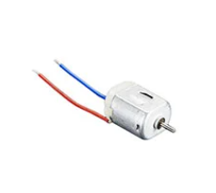
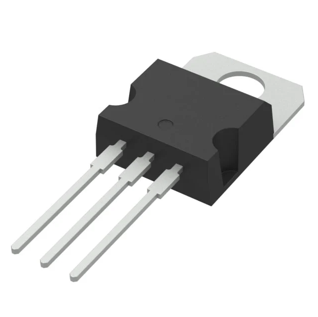
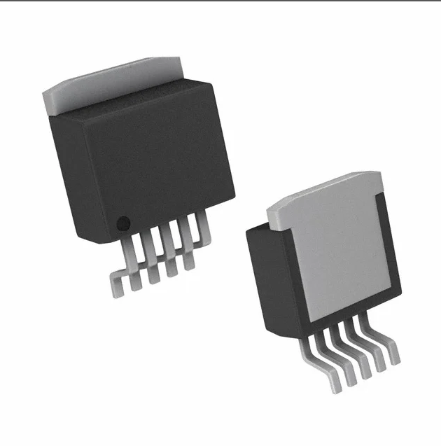
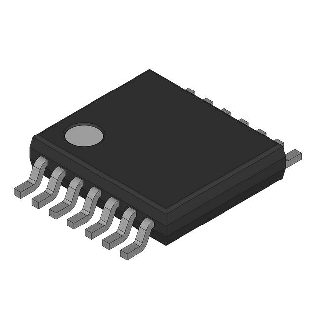
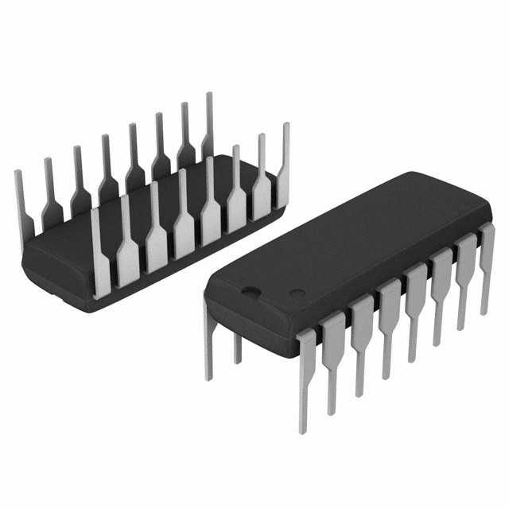
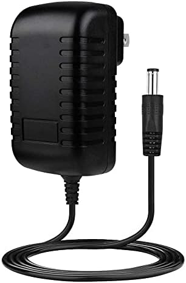

### Componenet Selection

**DC Motor**

1. AdaFruit 711 DC Motor

   

 * $1.95/each
* [link to product](https://www.digikey.com/en/products/detail/adafruit-industries-llc/711/5353610gclsrc=aw.ds&gad_source=1&gad_campaignid=20243136172&gbraid=0AAAAADrbLlhl1FW1Wjj4ieek0F8WLsTTK&gclid=CjwKCAjwjffHBhBuEiwAKMb8pIf5j8fn3Y5DqKT9JQaZDD6ReWLr_gdSpv1T_ynpheKjqwGf2sxxZBoCSCIQAvD_BwE)

    | Pros                                                              | Cons                |
    | ----------------------------------------------------------------- | ------------------- |
    | Very high no-load speed (~9,100 RPM) — good for fast small mechanisms and toy/hobby use. | Low rated torque (≈10 g·cm / 0.098 N·cm) — not suitable for heavy loads or direct-drive high-torque tasks. |
    | Low no-load current (~70 mA) and modest loaded current (~250 mA) — easy to drive from small motor drivers or battery packs. | Stall current fairly low (~500 mA) but still requires driver/device that can handle stalls; continuous high load will overheat. |
    | Rated 6 V (operating range commonly ~4.5–9 V for hobby use) — flexible for 5 V/6 V/9 V systems. | Not specified for precision speed control or long-term continuous duty at higher voltages; expect shorter life if run hot/overloaded. |
    | 130-size hobby motor — small (≈27.5 × 20 × 15 mm), light (~17.5 g) and easy to integrate into hobby builds; common shaft diameter (2 mm). | Shaft is small (2 mm) and short (8 mm) — may need couplers/gears for secure mounting; no integrated mounting flanges — adds mechanical adaptation work. |
    | Excellent for lightweight robotics, small fans, toys, and prototyping where speed > torque. | Poor choice for gearless drivetrains, heavy actuators, or continuous high-torque applications without gearing. |

2. HG37-120-AA-00

    

    * $29.92/each
    * [Link to product](https://www.digikey.com/en/products/detail/nidec-components-corporation/HG37-120-AA-00/14553405?gclsrc=aw.ds&gad_source=1&gad_campaignid=20243136172&gbraid=0AAAAADrbLljBQunprEOtznelsRLs-J4uH&gclid=CjwKCAjwmNLHBhA4EiwA3ts3mSe77BaK-WFdIAoTd1RI54J1lqSxFic8uShvaWAAsPBEAm5zt6otORoC6HsQAvD_BwE)

    | Pros                                                              | Cons                |
    | ----------------------------------------------------------------- | ------------------- |
    | Integrated planetary gearbox (1:120) — delivers usable low speed and much higher output torque than raw motor. Good for compact, low-RPM actuators.                                            | Relatively high unit cost.      |
    | Moderate continuous torque (~392 mN·m) — suitable for small mechanical loads without extra gearbox.                               | Brushed DC motor (likely) — brush wear and EMI; not as long-lived as brushless options for heavy continuous-duty applications. |
    | Compact (Ø37 mm) — small footprint that fits into constrained mechanical designs. | No integrated encoder/feedback — add external encoder or sensor for closed-loop position/speed control. |

3. **Custom Electrical Option/Mechanical Option**
       A compact planetary gearbox + output rotary encoder + driver + mounting built around a small DC can motor. This option is intended where off-the-shelf torque/speed/feedback packages are unavailable or you want tighter control over form-factor, gear ratio, and sensor placement.

   | Pros                                      | Cons                                                             |
   | ----------------------------------------- | ---------------------------------------------------------------- |
   |Custom ratio & footprint — choose exact gear ratio, shaft length, and mounting pattern to fit your device.| Higher design & build complexity vs buying an off-the-shelf geared motor.|
   |Easier maintenance/repair — you can replace gears, bearings, encoder separately.|Prototype accuracy depends on manufacturing quality (3D printed gears/print tolerances introduce backlash).|
   |Integrated high-resolution feedback — encoder on output gives direct, backlash-compensated position readings.|Longer development time & potential higher unit cost for single pieces.|

**Choice and Rationale**
    The Adafruit 711 DC motor is an appropriate choice for our autonomous irrigation project due to its low power consumption, compact size, and simple control requirements. Operating efficiently at a range up to 9V with a low current draw, it can be easily powered by our chosen H-Bridge. Its high rotational speed and lightweight design make it suitable for driving small pumps, valves, or mechanical actuators that manage water flow in an irrigation setup. While it is not intended for heavy-duty pumping, it offers a cost-effective and reliable option for demonstration-scale or prototype irrigation systems, where energy efficiency and ease of integration with microcontrollers are priorities.
   
**Voltage Regulator**

1. L7805CV

    

    * $0.50/each
    * [link to product](https://www.digikey.com/en/products/detail/stmicroelectronics/L7805CV/585964)
 
    | Pros                                      | Cons                                                             |
    | --------------------------------------------- | ---------------------------------------------------------------- |
    | Provides a **stable and regulated 5V output**, ideal for powering microcontrollers, sensors, and logic circuits.     | Being a **linear regulator**, it dissipates excess voltage as heat — inefficient for high input-output voltage differences or high current loads. |
    | **Simple to use** — requires only two external capacitors for stable operation.                                      | **Thermal dissipation** can be significant; may require a heat sink if current exceeds ~500 mA with large voltage drop.                           |
    | **Built-in protection** features include thermal shutdown, short-circuit protection, and current limiting.           | **Input voltage must be at least 2V higher** than the output (dropout voltage ~2V), so it’s not suitable for low headroom power supplies.         |
    | **Common, inexpensive, and widely available** in through-hole (TO-220) and surface-mount packages.                   | Not efficient for **battery-powered systems**, as it wastes power as heat compared to switching regulators.                                       |
    

2. LM2596S-5.0/NOPB

        

    * $6.97/each
    * [Link to product](https://www.digikey.com/en/products/detail/texas-instruments/LM2596S-5-0-NOPB/334842?gclsrc=aw.ds&gad_source=1&gad_campaignid=120565755&gbraid=0AAAAADrbLlhiVO2X4tb4kz7_jZIGtwYQb&gclid=CjwKCAjwjffHBhBuEiwAKMb8pIywmR_rOZ2D7phSToa-dDFOJG8xSLg9A2nu5mbH3dzjYsYaxZFg4BoCqPYQAvD_BwE)

| Pros                                                                  | Cons               |
| --------------------------------------------------------------------- | ------------------ |
| **High efficiency (switching regulator)** — Because it’s a buck converter operating at ~150 kHz, it wastes much less power as heat compared to linear regulators. | **Requires external components** — You’ll need to choose and size inductor(s), diode(s), capacitors properly. More design effort than a simple 3-terminal linear regulator. |
| **Wide input voltage range** — Operates from ~4.5 V up to 40 V input, making it suitable for many battery/solar systems.| **Requires good layout/thermal considerations** — At high currents or large input/output difference, cooling and PCB layout become important to avoid overheating or noise. |
| **3 A output current capability** — Good for powering moderate loads.| **Not fully synchronous** — Because it is a non-synchronous switcher (requires external catch diode), the efficiency at very high load or low input/output difference may not match modern synchronous converters. |

3. **Custom Electrical Option/Mechanical Option**
    A custom alternative to an off-the-shelf voltage regulator could use a **discrete buck converter** built with a MOSFET, Schottky diode, inductor, and a PWM control IC such as the LM2576. This design offers **higher efficiency and lower heat generation** than linear regulators, ideal for solar or battery-powered irrigation systems. The circuit would include filtering capacitors, feedback resistors, and over-current protection, mounted on a custom PCB with proper heat dissipation and a protective enclosure. This approach provides **flexibility, better energy use, and easier integration** into the system’s control board while reinforcing key design and learning objectives.

| Pros                                                                                                                                 | Cons                                                                                                                             |
| ------------------------------------------------------------------------------------------------------------------------------------ | --------------------------------------------------------------------------------------------------------------------------------- |
| **High efficiency** — far less power wasted as heat vs. linear regs, improving battery/solar run-time.                               | **Higher design complexity** — requires correct selection of MOSFET, diode/inductor, controller, layout and compensation.         |
| **Smaller heatsinking** — lower dissipation means smaller heatsinks or none, enabling more compact designs.                          | **Greater EMI/noise** — switching creates electrical noise that may need filtering for sensitive sensors/MCU.                     |
| **Easier integration** — can place connectors, filters, and monitoring points exactly where the project needs them.                  | **Sourcing / lead-time** — specific inductors or low-Rds(on MOSFETs) may have lead times or price variability.                    |
| **Custom protection options** — include input TVS, soft-start, current limit, thermal shutdown, reverse polarity protection.         | **Regulatory / safety testing** — if deployed outdoors or in schools, you may need to validate safety/EMC which increases effort. |

**Choice and Rationale**
    The **L7805CV voltage regulator** is a practical choice for our project because it provides a **simple, reliable, and stable 5V output** for powering microcontrollers, sensors, and control circuits. Its **ease of use**—requiring only minimal external components—makes it ideal for quick prototyping and meets the overall requirements for our projects. The built-in **thermal shutdown, current limiting, and short-circuit protection** features ensure safe and consistent operation, even under less-than-ideal conditions. Although it is less efficient than modern switching regulators, the L7805CV’s **low cost, availability, and straightforward design** make it a solid solution for our purposes.

   **H Bridge**

1. FAN8100N

    

    * $1.16/each
    * [link to product](https://www.digikey.com/en/products/detail/fairchild-semiconductor/FAN8100N/11558200)

    | Pros                                      | Cons                                                             |
    | ----------------------------------------- | ---------------------------------------------------------------- |
    | Wide operating voltage range (1.8 V–9 V motor supply, 2.2 V–9 V logic) — compatible with most microcontrollers and battery-powered systems. | Limited maximum voltage (9 V) — unsuitable for higher-voltage motor applications. |
    | Dual H-bridge channels in a single IC — allows control of two DC motors or one stepper motor.| Moderate current capacity (≈0.8 A typical per channel, ~1.5 A peak) — insufficient for large or high-torque motors. |
    | Low standby current (~0.1 µA) and efficient operation for light loads.| Power dissipation limited (~2 W max) — thermal protection may trigger under continuous heavy load.|
    | Includes internal diodes, thermal shutdown, and short-circuit protection — enhances safety and reliability. | Protection circuitry cannot compensate for sustained overloads or poor heat sinking.|

2. HIP4082IPZ

    

    * $2.70/each
    * [Link to product](https://www.digikey.com/en/products/detail/renesas-electronics-corporation/HIP4082IPZ/821447)

    | Pros                                                              | Cons                |
    | ----------------------------------------------------------------- | ------------------- |
    |Four independent channels — flexible configuration for half-bridge or full H-bridge control.|Not a standalone motor driver — requires external power MOSFETs for current handling.|
    | High voltage tolerance (up to 80 V) — supports large DC motors or inductive loads.| Complex circuit design — needs bootstrap capacitors, MOSFET selection, and protection circuitry. |
    | High drive current (2.5 A) — enables fast switching of large MOSFET gates. |Requires proper PCB layout — sensitive to high dv/dt and EMI in high-current applications.|

3. **Custom Electrical Option/Mechanical Option**
       Build a robust, efficient, bidirectional motor driver (H-bridge) that supports PWM speed control, current limiting, and fast switching for motors up to chosen supply.
   
| Pros                                               | Cons        |
|-------------------------------------------------------------------| ---------------------------------------------------------------------------------------------------------------------------------- |
| **Fully customizable** — can tailor voltage/current capacity, switching speed, and thermal handling for specific motor requirements. | **Complex design** — requires careful timing and dead-time control to prevent MOSFET shoot-through.|
| **Potentially lower cost per unit** when built in quantity, since components can be sourced individually.                            | **More development time** — circuit design, testing, and PCB layout take significantly longer than using an integrated H-bridge IC. |
| **Higher current handling** — discrete MOSFETs can support higher power motors compared to small integrated drivers.                 | **Requires external logic** — needs a separate driver or microcontroller PWM logic to control switching safely.                     |
| **Easier repairability** — individual transistors and components can be replaced if damaged.                                         | **Thermal management challenges** — heat sinks or fans may be needed to maintain safe operating temperatures.                       |

**Choice and Rationale**
    The **FAN8100N H-bridge** is well-suited for driving the **Adafruit 711 DC motor** because their electrical characteristics complement each other. The 711 motor operates at around **6 V** and draws less than **300 mA** under typical load, which fits comfortably within the FAN8100N’s **0.8 A continuous** and **1.5 A peak** current limits. The H-bridge’s **dual-channel design** enables bidirectional speed and direction control for one or two small motors, making it ideal for tasks like opening and closing valves or actuating small pumps. Additionally, the **low standby current** and **integrated protection features** (thermal shutdown, short-circuit protection, and flyback diodes) help ensure safe and efficient operation in our low power system. Overall, this pairing provides a **cost-effective, reliable, and easy-to-interface** motor control solution that balances simplicity with sufficient performance for our project requirements.

**Power Supply**
1. BestCH 9V 3A AC Adapter

   

* $4.52/each
* [Link to product](https://www.amazon.com/gp/product/B09ZTKTLGW/)
  
| Pros                                                                                                                                        | Cons                                                                                                                                                                                                        |
| ------------------------------------------------------------------------------------------------------------------------------------------- | ----------------------------------------------------------------------------------------------------------------------------------------------------------------------------------------------------------- |
| Widely available and inexpensive — easy to buy for a school project and replace if needed.                                                  | Output of 9 V may **not** match your required voltage (for example, if you need 5 V) — you may need additional regulation or conversion.                                                                    |
| Likely supports a wide input range (100-240 V AC) — convenient for lab/classroom/worldwide use.                                             | Being a generic adapter, specification details (ripple, exact current capability, transient response) may be less reliable or documented than name-brand regulated units.                                   |
| Provides 3 A output — a decent current capacity for moderate loads (sensors, microcontrollers, small actuators) in your irrigation project. | If your project requires higher continuous current, or if the motor/start-up surge exceeds its rating, this adapter may not suffice. Also heat dissipation may be an issue when pushing near full load.     |
| Barrel-plug output and standard form factor — easy to integrate into wiring harness and enclosure without custom PCB design.                | The 9 V output means either you must design downstream regulation (e.g., step-down to 5 V) or ensure your load is compatible — extra components add cost/complexity.                                        |
| Off-the-shelf convenience — no need to design your own power supply from scratch, saving student time.                                      | Generic adapters may have limited protections (overvoltage, overcurrent, thermal) or lesser durability for outdoor/uncontrolled environments (e.g., moisture, dust) compared to rugged industrial supplies. |

2. 9V 1.5A Adapter

   
   
   * $12.99/each
   * [Link to product](https://www.amazon.com/110-240Vac-Adapter-Positive-Arduino-Schwinn/dp/B08F78R13B)

| Pros                                               | Cons                                        |
| -------------------------------------------------- | ------------------------------------------- |
| Wide input voltage range (100-240V AC, 50/60Hz) — so it works in many regions/outlets. | Output is 9 V DC only — will need voltage regulation.  |
| Center-positive barrel plug with interchangeable tips — good flexibility for plugging into different devices. | Maximum current is 1.5A — may be insufficient for heavier loads, motor drivers or start-surge conditions.  |
| Built-in protections: overload, over-voltage, over-temperature, short-circuit — adds safety for general use. | Generic adapter: less detailed data on ripple/noise, transient response or suitability for sensitive electronics or motor noise environments. |

3. Custom Solution
   A simplified custom power supply for the irrigation project could use a single battery source (e.g., 12 V Li-ion or SLA pack) to directly power the 711 motor through the FAN8100N H-bridge, while a small discrete buck converter steps down the 12 V to 5 V for the microcontroller and sensors.

| Pros                                                                                                                     | Cons                                                                                                                                        |
| ------------------------------------------------------------------------------------------------------------------------ | ------------------------------------------------------------------------------------------------------------------------------------------- |
| **Simple design** — fewer components, smaller PCB, easier to assemble.                              | **Voltage regulation dependent on buck design** — if poorly built, 5 V rail may be noisy or unstable.                                       |
| **Direct motor drive** — 12 V battery feeds motor through H-bridge with minimal conversion losses, improving efficiency. | **Battery management required** — need to monitor charge, prevent over-discharge, and handle replacement/recharging.                        |
| **Compact and lightweight** — small enclosure, minimal heatsinks, fewer bulky components.                                | **Limited current capacity** — size of battery and buck converter limits total motor runtime and load capability.                           |
| **Low cost** — avoids purchasing commercial adapters; uses generic components like MOSFET, inductor, diode, capacitor.   | **Less protection against transients** — simpler design may be more vulnerable to voltage spikes or motor back-EMF without extra circuitry. |

**Choice and Rationale**
    The 9 V, 3 A power supply provides a simple, safe, and reliable source for the project’s microcontroller and sensors. With sufficient current to support a 5 V regulator, wide AC input, and built-in protections, it ensures stable operation of the logic and control electronics while simplifying the power design.

