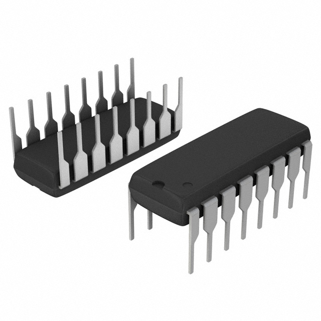

### Componenet Selection

**DC Motor**

1. PC280LG-301

    

    * $7.27/each
    * [link to product](https://www.digikey.com/en/products/detail/johnson-motor/PC280LG-301/12719595?s=N4IgTCBcDaIAoGEwA4AMAZA4gWgMyoEYQBdAXyA)

    | Pros                                      | Cons                                                             |
    | ----------------------------------------- | ---------------------------------------------------------------- |
    | Inexpensive                               | Requires external components and support circuitry for interface |
    | Compatible with PSoC                      | Needs special PCB layout.                                        |
    | Meets surface mount constraint of project |

2. HG37-120-AA-00

    

    * $29.92/each
    * [Link to product](https://www.digikey.com/en/products/detail/nidec-components-corporation/HG37-120-AA-00/14553405?gclsrc=aw.ds&gad_source=1&gad_campaignid=20243136172&gbraid=0AAAAADrbLljBQunprEOtznelsRLs-J4uH&gclid=CjwKCAjwmNLHBhA4EiwA3ts3mSe77BaK-WFdIAoTd1RI54J1lqSxFic8uShvaWAAsPBEAm5zt6otORoC6HsQAvD_BwE)

    | Pros                                                              | Cons                |
    | ----------------------------------------------------------------- | ------------------- |
    | Outputs a square wave                                             | More expensive      |
    | Stable over operating temperature                                 | Slow shipping speed |
    | Direct interface with PSoC (no external circuitry required) range |

**Soil Moisture Sensor**

1. 13637

    

    * $7.95/each
    * [link to product(https://www.digikey.com/en/products/detail/sparkfun-electronics/13637/7400839?gclsrc=aw.ds&gad_source=1&gad_campaignid=20243136172&gbraid=0AAAAADrbLljBQunprEOtznelsRLs-J4uH&gclid=CjwKCAjwmNLHBhA4EiwA3ts3mayriRdZcvui0HTdYMicDMSrmrPi3kqTxbDrLqTR_hUmT-cr0AV9jhoCaVgQAvD_BwE)

    | Pros                                      | Cons                                                             |
    | ----------------------------------------- | ---------------------------------------------------------------- |
    | Inexpensive                               | Requires external components and support circuitry for interface |
    | Compatible with PSoC                      | Needs special PCB layout.                                        |
    | Meets surface mount constraint of project |

2. SEN0114

    

    * $2.70/each
    * [Link to product](https://www.digikey.com/en/products/detail/dfrobot/SEN0114/6588525?gclsrc=aw.ds&gad_source=1&gad_campaignid=20243136172&gbraid=0AAAAADrbLljBQunprEOtznelsRLs-J4uH&gclid=CjwKCAjwmNLHBhA4EiwA3ts3mbQSvFXrFn6uSSuxGg_qehQQK9Uty_P8yXZ4lFzpzHMJX-7nO5745RoCtCwQAvD_BwE)

    | Pros                                                              | Cons                |
    | ----------------------------------------------------------------- | ------------------- |
    | Outputs a square wave                                             | More expensive      |
    | Stable over operating temperature                                 | Slow shipping speed |
    | Direct interface with PSoC (no external circuitry required) range |

   **H Bridge**

1. INA125P

    

    * $10.08/each
    * [link to product](https://www.digikey.com/en/products/detail/texas-instruments/INA125P/254670?gclsrc=aw.ds&gad_source=4&gad_campaignid=20228387720&gbraid=0AAAAADrbLlhdskTRyyOweqI0wZs3p_N9a&gclid=CjwKCAjwmNLHBhA4EiwA3ts3maSekNz6cEfK83rlFOWYgj_-v-7Q3MSDubHQqxA6B9jR7x_icL5iBhoC0mcQAvD_BwE)

    | Pros                                      | Cons                                                             |
    | ----------------------------------------- | ---------------------------------------------------------------- |
    | Inexpensive                               | Requires external components and support circuitry for interface |
    | Compatible with PSoC                      | Needs special PCB layout.                                        |
    | Meets surface mount constraint of project |

2. HIP4082IPZ

    

    * $2.70/each
    * [Link to product](https://www.digikey.com/en/products/detail/renesas-electronics-corporation/HIP4082IPZ/821447)

    | Pros                                                              | Cons                |
    | ----------------------------------------------------------------- | ------------------- |
    | Outputs a square wave                                             | More expensive      |
    | Stable over operating temperature                                 | Slow shipping speed |
    | Direct interface with PSoC (no external circuitry required) range |

