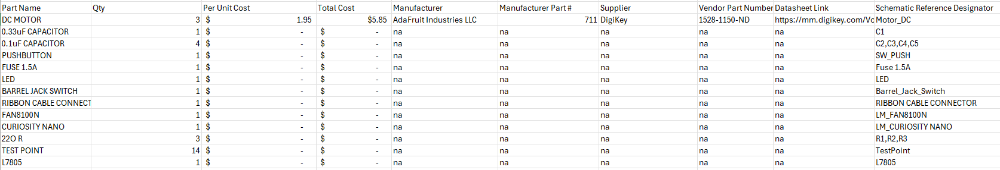

## Overview
The Bill of Materials (BOM) outlines all the electronic and mechanical components required for the project assembly. It includes a total of 14 unique parts, specifying component names, quantities, costs, manufacturers, suppliers, and schematic reference designators. Major components include the FAN8100N H-Bridge driver, PIC Curiosity Nano microcontroller, L7805 voltage regulator, and DC motors, which together form the core of the actuator subsystem. Supporting components such as capacitors, resistors, LEDs, test points, and connectors ensure proper power regulation, control, and signal interfacing. The only priced item currently listed is the DC motor, sourced from Adafruit via DigiKey. This structured BOM allows for accurate cost estimation, sourcing, and traceability within the circuit design. Fortunately the vast majority of these components have either been previously handed out in class or are readily available from the Peralta lab hence the lack of manufacturer data. 

## Bill of Materials 

