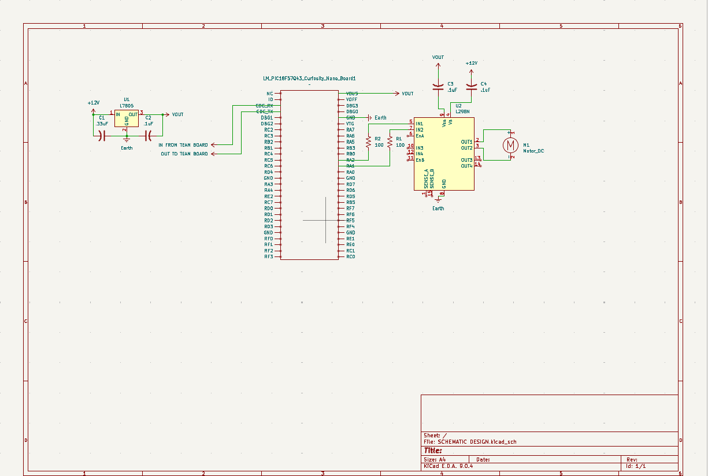

## Overview

This schematic is design to show my subsystem of the team project. My subsystem handles sending and receiving signals from the hub microcontroller and actuating the sprinkler head.

{style width:"350" height:"300;"}
**Figure ##:** Showing a example schematic.

## Resouces

The schematic as a PDF download is available [*here*](SCHEMATIC DESIGN.pdf), and the Zip folder of the project [*here*](dummyZip.zip).
