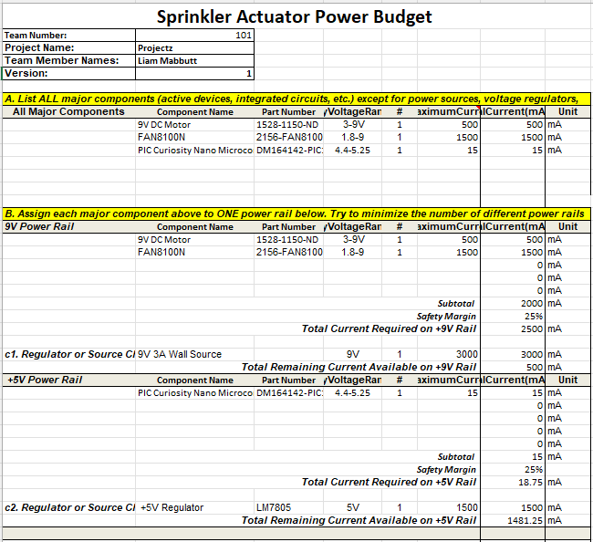
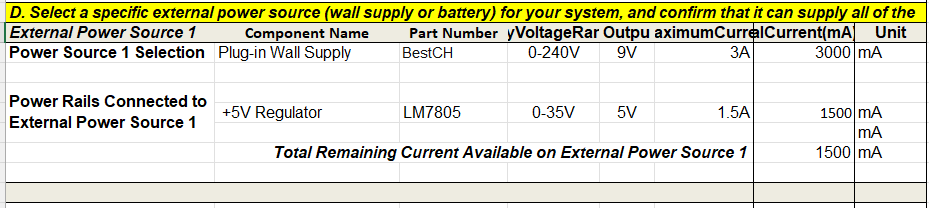

## Overview
The power budget outlines the key components and their expected electrical demands for the Sprinkler Actuator Subsystem. The system operates primarily on a 9 V power rail supplying three main devices: the Adafruit 711 DC Motor (1528-1150-ND), the FAN8100N H-bridge driver (2156-FAN8100N-FS-ND), and the PIC18F57Q43 Curiosity Nano microcontroller (DM164142-PIC18F57Q43).

## Conclusions

The power budget confirms that the autonomous irrigation system can operate efficiently within a modest 9 V, 3 A power envelope. The majority of the load is driven by the DC motor and H-bridge, as the microcontroller has negligible current draw. Overall, the design provides a reliable balance between performance and power economy, supporting continuous operation in a compact, low-maintenance setup.

## Resouces

The power budget as a PDF download is available [*here*](POWER_BUDGET.pdf), and a Microsoft Excel Sheet [*here*](POWER_BUDGET.xlsx).
