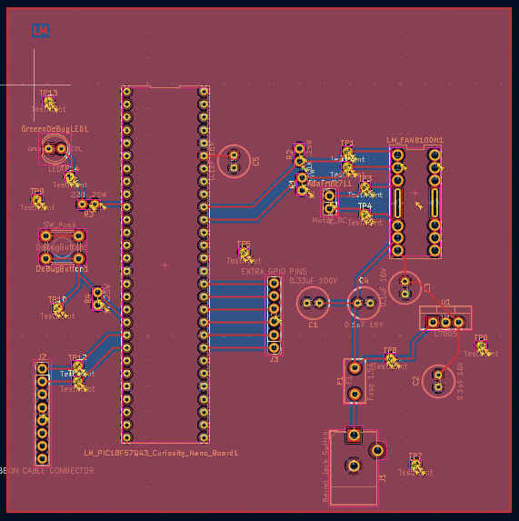

## Overview

This is the PCB design of my subsystem of the team project. My subsystem handles sending and receiving signals from the hub microcontroller and actuating the sprinkler head.

## Resouces

The PCB as a PDF download is available [*here*](PCB.pdf), the Gerber file folder of the project [*here*](GERBER.zip), and the zip file of the project [*here*](ECAD.zip).
